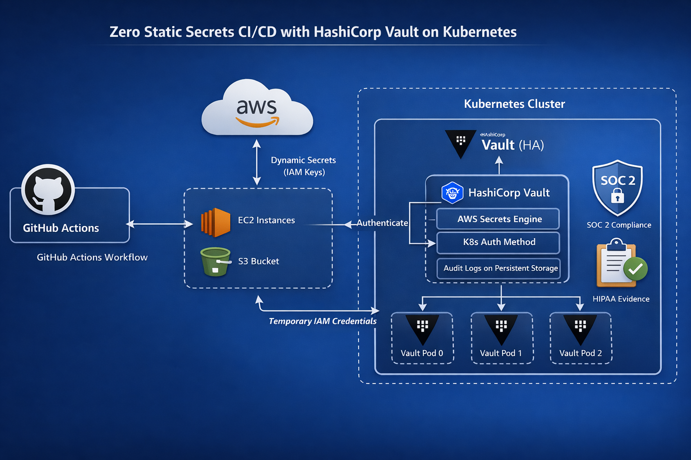

# Zero Static Secrets: Vault Dynamic AWS Credentials in Kubernetes CI/CD

Production-tested architecture for eliminating static AWS IAM keys from
Kubernetes CI/CD pipelines using HashiCorp Vault dynamic secrets.

## Architecture

## How it works

1. GitHub Actions runner authenticates to Vault using a Kubernetes service account JWT
2. Vault validates the identity, checks the policy, and calls AWS to create a temporary IAM user
3. Vault returns the credentials to the pipeline — valid for 15 minutes only
4. The pipeline deploys to AWS (ECR, S3, EC2) using those credentials
5. Credentials auto-expire and the IAM user is deleted — no manual rotation ever needed

## Repository structure

- `vault/helm-values/` — Helm values for HA Vault deployment on Kubernetes
- `vault/policies/` — Vault policy HCL (least-privilege, version-controlled)
- `vault/config/` — AWS secrets engine and audit logging configuration
- `kubernetes/auth/` — Kubernetes auth method setup and service account
- `github-actions/` — GitHub Actions workflow using hashicorp/vault-action
- `iam/` — IAM role and permission boundary for Vault root user
- `docs/` — Architecture diagram and compliance mapping

## Compliance

This architecture satisfies:
- **HIPAA** 164.312 — unique user ID, audit controls, automatic session termination
- **SOC 2** CC6.1 — least-privilege access, automated revocation, audit evidence
- **HITRUST** 01.a — policy-as-code access control, TTL-enforced expiry

See [docs/compliance-mapping.md](docs/compliance-mapping.md) for the full mapping.
